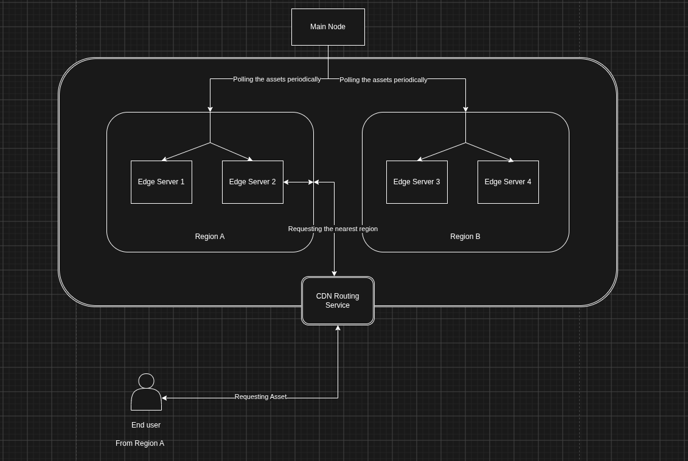

## Content Delivery Network

Content Delivery Network is a group of globally distributed servers which caches content close to the end users.

By content, we can infer that primary use case which it serves is it allows the client to download the assets (css, images, videos and html pages) from the server which is close to geolocation from the which the request was being made.

### CDN and Web host

While web hosting is a complete different concept, CDN does not host content like a web hosting service would do, it simply caches the content for enhacing the load time of a web application, which definitely improves the performance of the web application or the web page.

### Working of a CDN
- Edge Servers: CDN places servers which are basically called **Point of Presence** this servers will be remaining close to the end users.
- Caching: It stores copies of the static files from the main server.
- Routing: When a request comes in, the CDN redirects the request to the nearest Point of Presence, instead of routing to the main server.

Draft: Architecture

