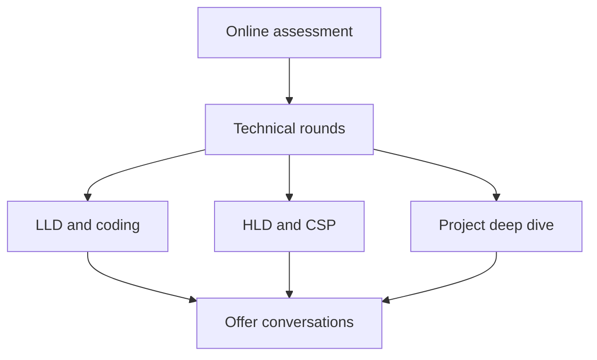
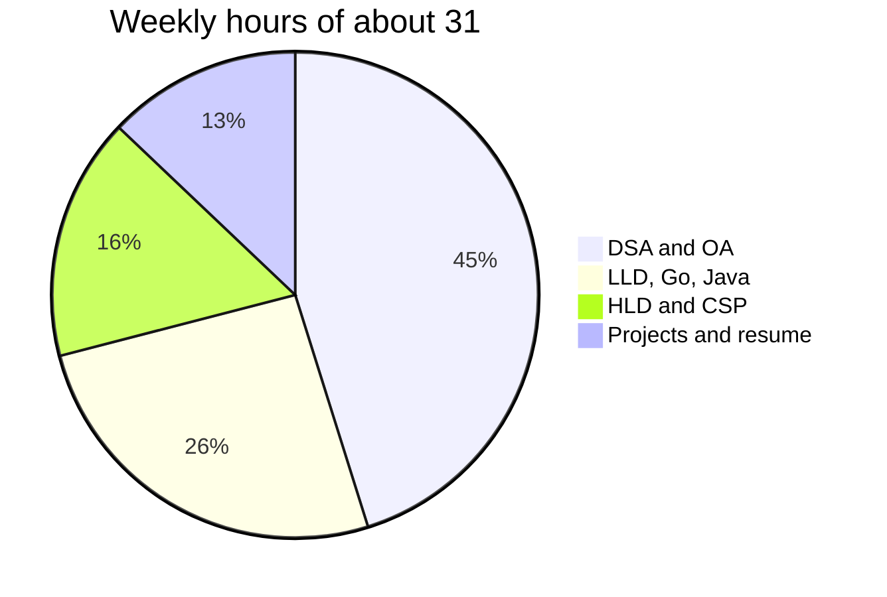
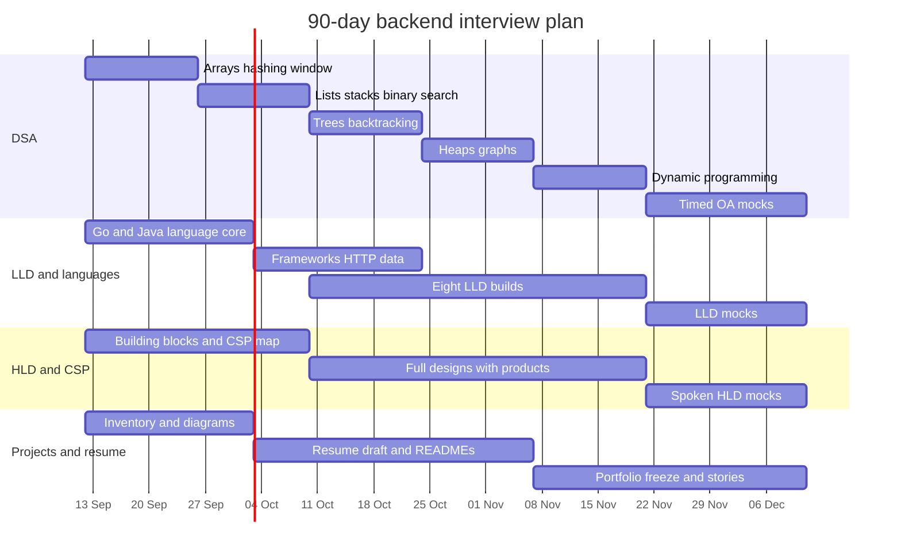

## Backend Knowledge Base

#### This repository contains the documents and the code references required for brushing up backend concepts.

> **Note:**
> Read each reference in a sequential way to understand the steps taken by the maintainer in keeping the documentation and the source code standardized.

- [Project Directory Schema](assets/markdown/project-directory-schema.md)
- [Development Guidelines](assets/markdown/development-guidelines.md)
- [Golang](golang/README.md)
- [Python](python/README.md)
- [Java](java/README.md)

## Preparation

A parallel-track plan for backend interviews. Online assessments are the gate, so DSA stays daily. Language, design, and project work run beside it so the technical round and resume stay ready at the same time.

Target cadence: **5–6 hours on weekdays**, **10–11 hours on weekends** (~32–34 hours/week, ~410–430 hours total).

---

### High-level view

Four tracks run for all 90 days. Intensity shifts by phase; nothing is parked until the last month.

| Track | Outcome | Share of weekly time |
| --- | --- | --- |
| DSA and OA | Clear timed LeetCode / HackerRank screens | ~45% |
| LLD, clean code, Go, Java | Design and implement components with language fluency | ~25% |
| HLD and CSP products | Drive a 45-minute system design discussion | ~15% |
| Projects, resume, portfolio | Defensible stories, one-page resume, public proof | ~15% |

```mermaid
flowchart LR
  subgraph P1["Days 1–30 · Foundations"]
    A1[DSA patterns]
    A2[Go and Java core]
    A3[HLD building blocks]
    A4[Project inventory]
  end
  subgraph P2["Days 31–60 · Application"]
    B1[Medium and hard DSA]
    B2[LLD in Go and Java]
    B3[Full system designs]
    B4[Resume draft and diagrams]
  end
  subgraph P3["Days 61–90 · Interview mode"]
    C1[Timed OA mocks]
    C2[LLD and HLD mocks]
    C3[CSP tradeoff drills]
    C4[Portfolio freeze]
  end
  P1 --> P2 --> P3
```

Phase intent:

- **Days 1–30 — Foundations.** Pattern catalog for DSA, language internals, HLD vocabulary, list every project you can defend.
- **Days 31–60 — Application.** Write production-shaped code, complete system designs, turn projects into diagrams and resume bullets.
- **Days 61–90 — Interview mode.** Timed mocks, spoken explanations, freeze the resume and portfolio, apply.

---

### Weekly time box

Keep this split unless a mock shows a weak track. Then steal hours from the strongest track for two weeks, not from DSA.

Weekday template (5–6 hours, e.g., 5.5 hours):

1. **2.5 hours** DSA (one pattern, 2–3 problems, write the solution from memory the second time).
2. **1.5 hours** LLD or language (alternate Go and Java by day).
3. **1 hour** HLD notes and one project artifact (diagram, STAR bullet, README).

Weekend template (9–10 hours, e.g., 9.5 hours):

1. **4 hours** mixed DSA set or a HackerRank-style OA.
2. **2.5 hours** one full LLD implementation or one complete HLD design on paper.
3. **2 hours** resume, portfolio, project walkthrough out loud, and review notes.
4. **1 hour** buffer for overflow or weak-area drills.

---

### Track 1 — DSA and online assessments

Goal: solve a medium in 25 minutes with a spoken approach, then code without stalling on I/O or edge cases.

**Order of patterns (do not skip ahead until you can re-solve yesterday's problems cold):**

**Weeks 1–2 — Arrays, Strings, and Basic Pointers (Daily Breakdown)**
- [ ] **Day 1: Array Basics & Prefix Sums**
  - [ ] Understand static vs dynamic arrays in memory.
  - [ ] Implement and apply prefix sums (1D).
- [ ] **Day 2: Hashing Basics (Sets & Maps)**
  - [ ] Understand hash functions and collision resolution.
  - [ ] Solve problems using Hash Sets for uniqueness and Hash Maps for frequencies.
- [ ] **Day 3: Hashing & Array Combinations**
  - [ ] Map indices to values for O(1) lookups.
  - [ ] Grouping patterns (e.g., anagrams, pairs).
- [ ] **Day 4: String Manipulation**
  - [ ] ASCII values, character counting, string reversal.
  - [ ] Palindrome checks and string building.
- [ ] **Day 5: Two Pointers (Opposite Ends)**
  - [ ] Array traversal from both ends towards the center.
  - [ ] Finding pairs in sorted arrays or checking palindromes.
- [ ] **Day 6: Two Pointers (Same Direction)**
  - [ ] Fast & Slow pointers (Tortoise and Hare).
  - [ ] In-place array modification (removing duplicates, moving zeroes).
- [ ] **Day 7: Sliding Window (Fixed Size)**
  - [ ] Maintain a window of size K.
  - [ ] Calculate rolling averages or max/min in subarrays.
- [ ] **Day 8: Sliding Window (Variable Size)**
  - [ ] Expand window with right pointer, shrink with left pointer.
  - [ ] Optimizing for longest/shortest substrings meeting conditions.
- [ ] **Day 9: Sliding Window + Hashing**
  - [ ] Keep track of character frequencies within a window.
  - [ ] Handle string permutations and anagrams.
- [ ] **Day 10: Matrix & Grid Traversal**
  - [ ] 2D array traversal (row-by-row, column-by-column).
  - [ ] Matrix transformations (rotation, spiral order).
- [ ] **Day 11: Intervals (Basics & Merging)**
  - [ ] Sorting intervals by start/end times.
  - [ ] Merging overlapping intervals.
- [ ] **Day 12: Intervals (Advanced)**
  - [ ] Inserting new intervals.
  - [ ] Finding minimum overlaps (e.g., meeting rooms).
- [ ] **Day 13: Greedy Basics with Arrays**
  - [ ] Making local optimal choices (e.g., maximum subarray sum).
  - [ ] Jump games and gas station patterns.
- [ ] **Day 14: Review & Timed OA Mock**
  - [ ] Re-solve 3 failed/hardest problems from the past 13 days cold.
  - [ ] Complete a 60-minute timed mock on HackerRank.

*(See [track1-weeks1-2-questions.md](assets/markdown/track1-weeks1-2-questions.md) for the daily problem links).*

**Weeks 3–4 — Linear Structures & Searching**
- [ ] **Stack**: LIFO mechanics, monotonic stacks (e.g., next greater element), valid parentheses.
- [ ] **Queue**: FIFO mechanics, circular queues, monotonic queues.
- [ ] **Linked List**: Reversal, cycle detection, merging, and LRU cache foundations.
- [ ] **Binary Search**: Classic search, search in rotated sorted arrays, binary search on answer space (e.g., Koko eating bananas).

**Weeks 5–6 — Trees & Exhaustive Search**
- [ ] **Trees & BST**: Traversals (Inorder, Preorder, Postorder, Level order), lowest common ancestor, diameter, validating BSTs.
- [ ] **Recursion**: Base cases, call stack understanding, memoization basics.
- [ ] **Backtracking**: Permutations, combinations, subsets, N-Queens, word search.
- [ ] **Tries (Prefix Trees)**: Word dictionary, autocomplete foundations.

**Weeks 7–8 — Graphs, Heaps, & Advanced Structures**
- [ ] **Heap / Priority Queue**: Top K elements, median of data stream, K-way merge.
- [ ] **Graphs**: BFS (shortest path in unweighted), DFS (connected components), matrix traversal (islands).
- [ ] **Advanced Graphs**: Topological sort (Kahn's algorithm), Union-Find (Disjoint Set), Dijkstra's algorithm (shortest path).
- [ ] **Greedy Algorithms**: Local optimum choices, jump games, task scheduling.

**Weeks 9–10 — Dynamic Programming & Math**
- [ ] **1D DP**: Climbing stairs, house robber, longest increasing subsequence (LIS).
- [ ] **2D DP**: Longest common subsequence (LCS), edit distance, unique paths.
- [ ] **0/1 Knapsack**: Target sum, partition equal subset sum.
- [ ] **Bit Manipulation & Math**: XOR tricks, counting bits, basic modular arithmetic.

**Weeks 11–13 — OA Simulations & Mixed Practice**
- [ ] **Mixed Context**: LeetCode weekly contests, company-tagged problem sets.
- [ ] **SQL Basics**: Joins, aggregations, window functions (frequently asked in OAs).
- [ ] **Timed OA Simulation**: HackerRank timed tests (strict 90 mins).

**Execution Rules & OA Extras (Start Week 3):**
- [ ] **Volume Target**: 12–15 quality problems/week (~150–180 total).
- [ ] **Thinking Protocol**: For every problem, write 4 lines before code: `Input/Output` → `Brute Force` → `Bottleneck` → `Optimized Approach & Complexity`.
- [ ] **I/O Parsing**: Practice `stdin`/`stdout` parsing, handling multiple test cases, and formatting outputs (HackerRank style).
- [ ] **Constraints & Tuning**: Understand time complexities based on input sizes (e.g., $N \le 10^5$). Prefer iterative over deep recursion in Java to avoid StackOverflow.

Exit criteria for day 90: two back-to-back 90-minute mocks at ~75%+ with no panic on a new medium.

---

### Track 2 — LLD, clean code, Go and Java

Goal: in 45 minutes, clarify requirements, sketch types, implement a working core, and name the tradeoffs.

**Design Principles (Review Checklist):**
- [ ] **Object-Oriented & Structural**: Apply SOLID principles, favor composition over inheritance, and keep interfaces small/focused.
- [ ] **Error Handling**: Treat failures as values (wrapped errors in Go, explicit result types/checked exceptions in Java).
- [ ] **Robustness**: Ensure idempotency, strictly validate at system boundaries, and eliminate hidden global state.
- [ ] **Testing**: Write automated tests for the happy path and at least one failure path before considering a feature complete.

**Phase 1: Language Core (Weeks 1–3)**
- [ ] **Golang Fundamentals**
  - [ ] Structs, interfaces, and composition over inheritance.
  - [ ] Goroutines, channels, and the `context` package.
  - [ ] Error wrapping, modules, and `testing` package basics.
- [ ] **Java Fundamentals**
  - [ ] JVM internals, memory model, and Garbage Collection.
  - [ ] Collections framework, generics, and Java streams.
  - [ ] Concurrency (`java.util.concurrent`), locks, and exceptions.

**Phase 2: Frameworks, HTTP, and Data (Weeks 4–6)**
- [ ] **Golang Web & Data**
  - [ ] `net/http`, routers (Chi/Echo/Gin), and middleware chaining.
  - [ ] `database/sql`, ORMs (sqlc/GORM), migrations, and transactions.
  - [ ] gRPC, worker pools, and graceful shutdown patterns.
- [ ] **Java Web & Data**
  - [ ] Spring Boot, Spring MVC, REST validation, and Actuator.
  - [ ] Spring Data JPA, raw JDBC, and declarative `@Transactional`.
  - [ ] Spring events, asynchronous execution (`@Async`), and virtual threads.

**Phase 3: The 8 LLD Builds (Weeks 7–12)**
*(Alternate languages per build. Each must include: package layout, interfaces, tests, and a 10-line README of decisions.)*
- [ ] **Build 1: URL Shortener** (Hashing, collision resolution, base62 encoding, persistence).
- [ ] **Build 2: Rate Limiter** (Token bucket/sliding window, thread-safe concurrency, middleware integration).
- [ ] **Build 3: LRU / Write-Through Cache** (Doubly linked lists + hash maps, eviction policies, fast lookups).
- [ ] **Build 4: Parking Lot / Ticket Booking** (State machines, concurrent resource access, pricing logic).
- [ ] **Build 5: Notification Dispatcher** (Strategy pattern for Email/SMS, retry mechanisms, queueing).
- [ ] **Build 6: Splitwise Ledger OR Pub/Sub** (Graph algorithms for debt simplification OR topic/subscriber routing).
- [ ] **Build 7: Chat System** (WebSockets, user presence, fan-out messaging).
- [ ] **Build 8: Inventory Management** (ACID transactions, optimistic vs pessimistic locking).

*(See [track2-lld-resources.md](assets/markdown/track2-lld-resources.md) for architectural hints and reference links for these builds).*

Exit criteria: you can narrate a class/package diagram, write the core loop live, and map it to SOLID without reading notes.

---

### Track 3 — HLD and cloud / platform products

Goal: run a 45-minute design: requirements, estimates, API, data model, diagram, bottlenecks, and product choices with reasons.

**Weeks 1–4 — HLD Building Blocks (Daily Breakdown)**

**Week 1: Performance, Reliability & Networking**
- [ ] **Day 1**: Latency (p50/p95/p99) vs. Throughput (QPS/TPS).
- [ ] **Day 2**: Bandwidth, bottleneck identification, and back-of-envelope estimation basics.
- [ ] **Day 3**: High Availability (HA), Fault tolerance, and identifying Single Points of Failure (SPOF).
- [ ] **Day 4**: SLAs, SLOs, SLIs, and Failover strategies (Active-Active vs Active-Passive).
- [ ] **Day 5**: Networking Basics: DNS routing, TCP/UDP, and IP.
- [ ] **Day 6**: Load Balancing (L4 vs L7) and algorithms (Round-robin, least connections).
- [ ] **Day 7**: Reverse proxies, API Gateways, and CDNs (Push vs Pull).

**Week 2: Storage Systems & Data Partitioning**
- [ ] **Day 8**: SQL internals: Normalization, ACID, B-Trees, and Indexing.
- [ ] **Day 9**: NoSQL types: Key-Value and Document stores (e.g., DynamoDB, MongoDB).
- [ ] **Day 10**: NoSQL types: Wide-Column and Graph stores (e.g., Cassandra, Neo4j).
- [ ] **Day 11**: Specialized Storage: Object stores (S3), Time-series DBs, and Search engines (Elasticsearch).
- [ ] **Day 12**: Data Replication: Leader-follower, leader-leader, and leaderless architectures.
- [ ] **Day 13**: Data Sharding: Horizontal vs Vertical partitioning.
- [ ] **Day 14**: Consistent Hashing: Distributing load and handling data hotspots/celebrity problems.

**Week 3: Consistency Models, APIs & Caching**
- [ ] **Day 15**: CAP Theorem and PACELC Theorem.
- [ ] **Day 16**: Strong vs Eventual consistency, and Quorum consensus math ($R + W > N$).
- [ ] **Day 17**: Distributed Transactions: Saga pattern and 2-Phase Commit (2PC).
- [ ] **Day 18**: API Protocols: REST vs gRPC vs GraphQL.
- [ ] **Day 19**: Real-time APIs: WebSockets, Long Polling, and Server-Sent Events (SSE).
- [ ] **Day 20**: Caching Strategies: Read-through, write-through, write-behind, and cache-aside.
- [ ] **Day 21**: Cache Eviction (LRU/LFU), Cache stampede prevention, and Distributed caching (Redis).

**Week 4: Asynchronous Processing & Integration**
- [ ] **Day 22**: Async Patterns: Polling vs Webhooks vs Message Queues.
- [ ] **Day 23**: Message Queues (e.g., RabbitMQ, SQS) vs Event Streams (e.g., Kafka, Kinesis).
- [ ] **Day 24**: Pub/Sub models and fan-out architectures.
- [ ] **Day 25**: Message Delivery Guarantees: Exactly-once, at-least-once, at-most-once.
- [ ] **Day 26**: API Idempotency: Ensuring safe retries in distributed systems.
- [ ] **Day 27**: Resilience Patterns: Rate limiting, Circuit breakers, and Dead-letter queues.
- [ ] **Day 28**: Review & Synthesis: Combine concepts to sketch a high-level system (e.g., a simple URL shortener architecture).

*(See [track3-weeks1-4-resources.md](assets/markdown/track3-weeks1-4-resources.md) for deeper reading and conceptual breakdowns).*

**Weeks 5–10 — one full design per weekend**

- [ ] **Choose and implement one design per weekend (at least 6):**
  - [ ] Unique ID generator
  - [ ] Rate limiter
  - [ ] News feed
  - [ ] Chat application
  - [ ] Search / Autocomplete
  - [ ] Notification system
  - [ ] Video upload/streaming
  - [ ] Ride matching (e.g., Uber/Lyft)
  - [ ] URL shortener at scale
  - [ ] Log ingestion (leverage existing OpenSearch work)

For each design, name **concrete products**, not generic boxes, and write: *"I chose X over Y because …"* (Use `Cloud/` as the CSP reading list):

- [ ] **Compute**: EC2, ECS/EKS, Lambda, Cloud Run, GKE
- [ ] **API Edge**: API Gateway, ALB/NLB, CloudFront, Fastly
- [ ] **Data**: RDS/Aurora, Cloud SQL, DynamoDB, Spanner, Postgres, MongoDB
- [ ] **Cache**: ElastiCache Redis, Memorystore, CDN cache
- [ ] **Async**: SQS, SNS, EventBridge, Pub/Sub, Kafka
- [ ] **Object / Search**: S3, GCS, OpenSearch / Elasticsearch
- [ ] **Observability**: CloudWatch, OpenTelemetry, Grafana, structured logs
- [ ] **Identity**: IAM, IRSA, workload identity

**Weeks 11–13 — spoken drills**

- [ ] **Mock Interviews & Drills**
  - [ ] 45 minutes on a whiteboard or Excalidraw, no references
  - [ ] Always include: QPS and storage back-of-envelope estimations
  - [ ] Define failure modes and data lifecycles
  - [ ] Estimate costs and resource provisioning

Exit criteria: six designs you can redraw from memory, each with a CSP bill of materials and two rejected alternatives.

---

### Track 4 — "Sherpa" Product Deep-Dive & Resume

Goal: Demonstrate a deep, authoritative understanding of the "Sherpa" product you've worked on for the past year. Accumulate all engineering context into a structured journal and translate that impact into a polished resume.

**Days 1–10 — Accumulate & Inventory (Sherpa Context)**
- [ ] **Resource Gathering**: Collect all PRs, design docs, meeting notes, and existing architecture diagrams related to Sherpa.
- [ ] **Define the Core Context**:
  - [ ] What is the exact problem Sherpa solves and who are the end-users?
  - [ ] What was the broader team's scope versus your *exact* individual contributions?
  - [ ] Identify key metrics (e.g., latency improvements, cost reduction, volume handled, time saved).

**Days 11–45 — Journaling & Artifact Creation**
- [ ] **Design Diagrams**: 
  - [ ] Draw high-level context and container-level diagrams for Sherpa.
  - [ ] Map out internal services, data flows, database schemas, and third-party integrations.
- [ ] **Problem & Decision Journal**:
  - [ ] Document the top 3 complex engineering problems solved during Sherpa's development.
  - [ ] Detail architectural tradeoffs: why specific technologies were chosen over alternatives, and what you would do differently now.
  - [ ] Document at least one major production incident/mistake, the root cause, and how it was fixed.
- [ ] **STAR Stories Drafting**: Map your journal entries into Situation, Task, Action, Result formats for behavioral and project deep-dive rounds.

**Days 46–90 — Resume Update & Defense Rehearsal**
- [ ] **Resume Overhaul**: 
  - [ ] Condense the Sherpa journal into 3-4 heavy-hitting, quantified resume bullets.
  - [ ] Ensure backend keywords (Go, Java, APIs, Cloud, Data stores) reflect actual work done.
  - [ ] Keep to a strict one-page format with no generic duty lists.
- [ ] **Freeze & Review**: Send the updated resume to at least two reviewers by Day 70.
- [ ] **Defense Drills**: Twice a week for 15 minutes, explain a Sherpa design decision out loud. Practice defending against questions like *"Why did you choose that database?"* or *"What exact code did you write versus the rest of the team?"*

Exit criteria: A comprehensive technical journal for Sherpa, a finalized and reviewed one-page resume, and the ability to draw and defend Sherpa's architecture on a whiteboard from memory.

---

### Detailed 13-week calendar

Calendar below assumes a start of **12 Sep 2026** and an end of **11 Dec 2026**. Shift the dates if you start later.

| Week | DSA focus | LLD / languages | HLD / CSP | Projects |
| --- | --- | --- | --- | --- |
| 1 | Arrays, hashing | Go: interfaces, errors, modules | CAP, latency, load balancer | List all projects |
| 2 | Two pointers, sliding window | Java: collections, JVM, streams | Cache, CDN, DB vs cache | Draft architecture for project 1 |
| 3 | Stack, queue, linked list | HTTP servers in both languages | Postgres vs Dynamo vs object store | STAR for project 1 |
| 4 | Binary search | Persistence, transactions | Queues vs Kafka | Resume v1 |
| 5 | Trees | LLD: URL shortener (Go) | Unique ID + rate limiter designs | Diagram project 2 |
| 6 | Recursion, backtracking | LLD: rate limiter (Java) | News feed or chat | GitHub READMEs |
| 7 | Heap, intervals | LLD: LRU cache (Go) | Search + OpenSearch | Resume v2 |
| 8 | Graphs | LLD: parking lot / booking (Java) | Notifications at scale | Portfolio index |
| 9 | Graph + union-find | LLD: notification dispatcher + chat (Go) | Video or file upload | Mock project interview |
| 10 | DP core | LLD: ledger or pub/sub + inventory (Java) | One weak design redone | Freeze bullets |
| 11 | Mixed medium contest | Live LLD mock (Go) | Live HLD mock | Reviewer feedback |
| 12 | Company-tagged + OA | Live LLD mock (Java) | CSP "why this product" drills | Portfolio freeze |
| 13 | Two full OA simulations | Review notes only | Two HLD mocks | Apply; stories only |

---

### How to use this repository with the plan

- DSA solutions can live as small, well-named packages under `golang/` or `java/` if you want reviewable code; keep them separate from production-shaped LLD.
- LLD and patterns: extend `golang/design_patterns` and add a Java counterpart instead of scattering one-off files.
- HLD and CSP: take notes under `Cloud/` with a decision log per design.
- Projects: keep `Projects/` free of proprietary business logic; document architecture and snippets only.

---

### Weekly review (30 minutes, Sunday)

1. Count problems actually re-solved without the editorial.
2. One LLD or HLD artifact completed, not started.
3. One resume or project artifact improved.
4. If a track is red for two weeks, change the weekday template; do not add a fifth track.

