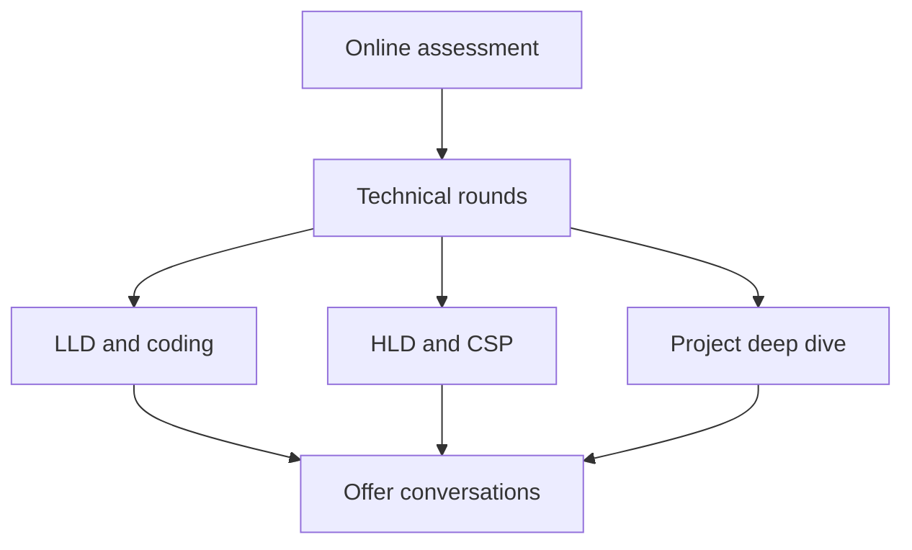
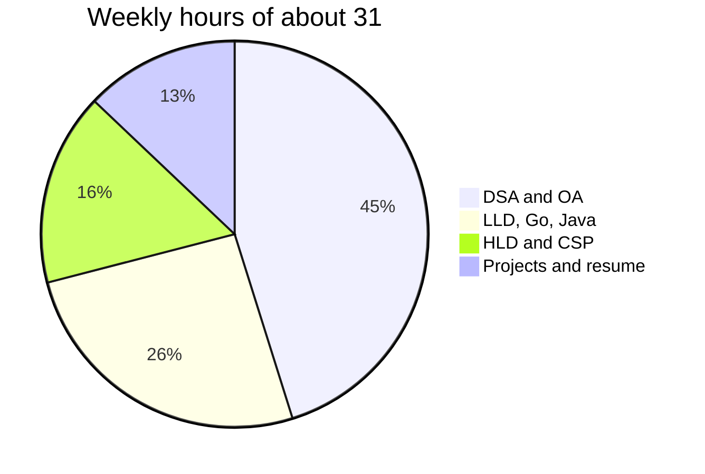
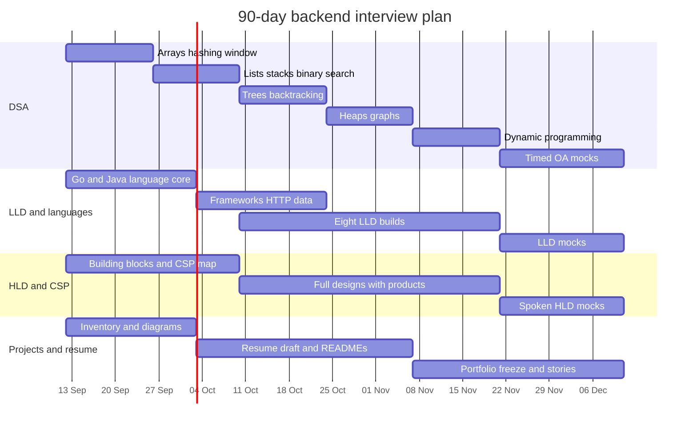

## Backend Knowledge Base

#### This repository contains the documents and the code references required for brushing up backend concepts.

> **Note:**
> Read each reference in a sequential way to understand the steps taken by the maintainer in keeping the documentation and the source code standardized.

- [Project Directory Schema](assets/markdown/project-directory-schema.md)
- [Development Guidelines](assets/markdown/development-guidelines.md)
- [90-day interview preparation](assets/markdown/90-day-interview-prep.md)
- [Golang](golang/README.md)
- [Python](python/README.md)
- [JavaScript](javascript/README.md)
- [TypeScript](javascript/README.md)
- [Java](java/README.md)

## Preparation

A parallel-track plan for backend interviews. Online assessments are the gate, so DSA stays daily. Language, design, and project work run beside it so the technical round and resume stay ready at the same time.

Target cadence: **5–6 hours on weekdays**, **9–10 hours on weekends** (~30–32 hours/week, ~390–410 hours total).

---

### High-level view

Four tracks run for all 90 days. Intensity shifts by phase; nothing is parked until the last month.

| Track | Outcome | Share of weekly time |
| --- | --- | --- |
| DSA and OA | Clear timed LeetCode / HackerRank screens | ~45% |
| LLD, clean code, Go, Java | Design and implement components with language fluency | ~25% |
| HLD and CSP products | Drive a 45-minute system design discussion | ~15% |
| Projects, resume, portfolio | Defensible stories, one-page resume, public proof | ~15% |

```mermaid
flowchart LR
  subgraph P1["Days 1–30 · Foundations"]
    A1[DSA patterns]
    A2[Go and Java core]
    A3[HLD building blocks]
    A4[Project inventory]
  end
  subgraph P2["Days 31–60 · Application"]
    B1[Medium and hard DSA]
    B2[LLD in Go and Java]
    B3[Full system designs]
    B4[Resume draft and diagrams]
  end
  subgraph P3["Days 61–90 · Interview mode"]
    C1[Timed OA mocks]
    C2[LLD and HLD mocks]
    C3[CSP tradeoff drills]
    C4[Portfolio freeze]
  end
  P1 --> P2 --> P3
```

Phase intent:

- **Days 1–30 — Foundations.** Pattern catalog for DSA, language internals, HLD vocabulary, list every project you can defend.
- **Days 31–60 — Application.** Write production-shaped code, complete system designs, turn projects into diagrams and resume bullets.
- **Days 61–90 — Interview mode.** Timed mocks, spoken explanations, freeze the resume and portfolio, apply.

---

### Weekly time box

Keep this split unless a mock shows a weak track. Then steal hours from the strongest track for two weeks, not from DSA.

Weekday template (5–6 hours, e.g., 5.5 hours):

1. **2.5 hours** DSA (one pattern, 2–3 problems, write the solution from memory the second time).
2. **1.5 hours** LLD or language (alternate Go and Java by day).
3. **1 hour** HLD notes and one project artifact (diagram, STAR bullet, README).

Weekend template (9–10 hours, e.g., 9.5 hours):

1. **4 hours** mixed DSA set or a HackerRank-style OA.
2. **2.5 hours** one full LLD implementation or one complete HLD design on paper.
3. **2 hours** resume, portfolio, project walkthrough out loud, and review notes.
4. **1 hour** buffer for overflow or weak-area drills.

---

### Track 1 — DSA and online assessments

Goal: solve a medium in 25 minutes with a spoken approach, then code without stalling on I/O or edge cases.

**Order of patterns (do not skip ahead until you can re-solve yesterday's problems cold):**

| Weeks | Patterns | Practice source |
| --- | --- | --- |
| 1–2 | Arrays, hashing, two pointers, sliding window | NeetCode 150 / Blind 75 |
| 3–4 | Stack, queue, linked list, binary search | Same + company-tagged easy/medium |
| 5–6 | Trees, BST, recursion, backtracking | Medium-first, one hard per week |
| 7–8 | Heap, graphs (BFS, DFS, topo), union-find | Include HackerRank graph-style I/O |
| 9–10 | DP: 1D, 2D, knapsack, LIS, string DP | Revisit failed problems first |
| 11–13 | Mixed contest, company tags, OA simulation | LeetCode contest + HackerRank timed |

Volume target: **about 12–15 quality problems per week** (~150–180 in 90 days), not 300 half-read editorials.

For every problem, write four lines before code: input/output, brute force, bottleneck, chosen approach and complexity. That is the OA thinking protocol.

HackerRank / OA extras (start week 3, one set each weekend):

- Parse stdin, multiple test cases, and large N without TLE.
- Time and memory limits; prefer iterative over deep recursion in Java.
- SQL, output formatting, and "complete the function" templates.

Exit criteria for day 90: two back-to-back 90-minute mocks at ~75%+ with no panic on a new medium.

---

### Track 2 — LLD, clean code, Go and Java

Goal: in 45 minutes, clarify requirements, sketch types, implement a working core, and name the tradeoffs.

**Design principles (use these as a review checklist, not a slogan list):**

- SOLID, composition over inheritance, small interfaces.
- Failures are values: wrapped errors in Go, checked exceptions or explicit result types in Java.
- Idempotency, validation at the boundary, no hidden globals.
- Tests for the happy path and one failure path before you call it done.

**Language and framework map (alternate languages by weekday):**

| | Golang | Java |
| --- | --- | --- |
| Language | Interfaces, goroutines, channels, `context`, memory model, error wrapping, modules, testing | JVM, collections, generics, streams, concurrency, memory and GC, exceptions |
| HTTP and APIs | `net/http`, Chi or Echo or Gin, middleware, JSON, versioning | Spring Boot, Spring MVC, validation, Actuator |
| Data | `database/sql`, sqlc or GORM, migrations, transactions | Spring Data JPA, JDBC, transactions |
| Service shape | gRPC, worker pools, graceful shutdown | Spring events, `@Async`, virtual threads if relevant |
| This repo | `golang/design_patterns`, concurrency, error, logger | `java/` services as implementation labs |

**LLD problems (implement at least eight, four in each language):**

1. URL shortener (hashing, collisions, storage).
2. Rate limiter (token bucket, per-key maps, concurrency).
3. LRU / write-through cache.
4. Parking lot or ticket booking (state machine).
5. Notification dispatcher (strategy + queue).
6. Splitwise-style expense ledger or a simple pub/sub.
7. Chat or messaging system.
8. Inventory or supply management.

Each implementation: package layout, interfaces, tests, a 10-line README of decisions. Prefer code in this repository over throwaway gists.

Exit criteria: you can narrate a class/package diagram, write the core loop live, and map it to SOLID without reading notes.

---

### Track 3 — HLD and cloud / platform products

Goal: run a 45-minute design: requirements, estimates, API, data model, diagram, bottlenecks, and product choices with reasons.

**Weeks 1–4 — building blocks**

- Latency vs throughput, availability, consistency (CAP / PACELC), idempotency.
- Load balancing, caching, CDNs, sharding vs replication.
- Queues vs streams, exactly-once vs at-least-once.
- Storage: object store, relational, document, search, cache, time-series.

**Weeks 5–10 — one full design per weekend**

Pick from: unique ID generator, rate limiter, news feed, chat, search, notification, video upload, ride matching, URL shortener at scale, log ingestion (you already have OpenSearch work).

For each design, name **concrete products**, not generic boxes:

| Concern | Products to be fluent in |
| --- | --- |
| Compute | EC2, ECS/EKS, Lambda, Cloud Run, GKE |
| API edge | API Gateway, ALB/NLB, CloudFront, Fastly |
| Data | RDS/Aurora, Cloud SQL, DynamoDB, Spanner, Postgres, MongoDB |
| Cache | ElastiCache Redis, Memorystore, CDN cache |
| Async | SQS, SNS, EventBridge, Pub/Sub, Kafka |
| Object / search | S3, GCS, OpenSearch / Elasticsearch |
| Observability | CloudWatch, OpenTelemetry, Grafana, structured logs |
| Identity | IAM, IRSA, workload identity |

Use `Cloud/` in this repo as the CSP reading list. After each design, write: "I chose X over Y because …"

**Weeks 11–13 — spoken drills**

- 45 minutes on a whiteboard or Excalidraw, no references.
- Always include: QPS and storage back-of-envelope, failure modes, data lifecycle, cost.

Exit criteria: six designs you can redraw from memory, each with a CSP bill of materials and two rejected alternatives.

---

### Track 4 — Projects, resume, portfolio

Goal: any interviewer can pick a project and you can defend architecture, your commits, and what you would change.

**Days 1–10 — inventory**

For every project you contributed to (including this knowledge base, OpenSearch log agent, LlamaIndex POC, Java mock API, Sedstart notes):

- Problem and users.
- Your scope vs the team.
- Architecture (one diagram).
- Three decisions and one mistake.
- Metric if you have it (latency, cost, volume, time saved). Otherwise a qualitative but honest outcome.

**Days 11–45 — artifacts**

- One architecture diagram per project (C4 container level is enough).
- STAR stories: situation, task, action, result.
- Resume: one page, backend keywords (Go, Java, APIs, data stores, cloud), quantified bullets, no duty lists.
- GitHub: README that a stranger can run or at least understand; pin 3–4 repos.

**Days 46–90 — freeze and rehearse**

- Freeze resume content by day 70; only fix typos after that.
- Portfolio: short index page or GitHub profile README linking diagrams, this repo, and 2–3 deep dives.
- Twice a week, 15 minutes: explain one project out loud as if the interviewer is hostile on ownership ("what did *you* merge?").

Exit criteria: resume sent to two reviewers, portfolio links live, five projects you can design on a blank page.

---

### Detailed 13-week calendar

Calendar below assumes a start of **12 Sep 2026** and an end of **11 Dec 2026**. Shift the dates if you start later.

| Week | DSA focus | LLD / languages | HLD / CSP | Projects |
| --- | --- | --- | --- | --- |
| 1 | Arrays, hashing | Go: interfaces, errors, modules | CAP, latency, load balancer | List all projects |
| 2 | Two pointers, sliding window | Java: collections, JVM, streams | Cache, CDN, DB vs cache | Draft architecture for project 1 |
| 3 | Stack, queue, linked list | HTTP servers in both languages | Postgres vs Dynamo vs object store | STAR for project 1 |
| 4 | Binary search | Persistence, transactions | Queues vs Kafka | Resume v1 |
| 5 | Trees | LLD: URL shortener (Go) | Unique ID + rate limiter designs | Diagram project 2 |
| 6 | Recursion, backtracking | LLD: rate limiter (Java) | News feed or chat | GitHub READMEs |
| 7 | Heap, intervals | LLD: LRU cache (Go) | Search + OpenSearch | Resume v2 |
| 8 | Graphs | LLD: parking lot / booking (Java) | Notifications at scale | Portfolio index |
| 9 | Graph + union-find | LLD: notification dispatcher + chat (Go) | Video or file upload | Mock project interview |
| 10 | DP core | LLD: ledger or pub/sub + inventory (Java) | One weak design redone | Freeze bullets |
| 11 | Mixed medium contest | Live LLD mock (Go) | Live HLD mock | Reviewer feedback |
| 12 | Company-tagged + OA | Live LLD mock (Java) | CSP "why this product" drills | Portfolio freeze |
| 13 | Two full OA simulations | Review notes only | Two HLD mocks | Apply; stories only |

---

### How to use this repository with the plan

- DSA solutions can live as small, well-named packages under `golang/` or `java/` if you want reviewable code; keep them separate from production-shaped LLD.
- LLD and patterns: extend `golang/design_patterns` and add a Java counterpart instead of scattering one-off files.
- HLD and CSP: take notes under `Cloud/` with a decision log per design.
- Projects: keep `Projects/` free of proprietary business logic; document architecture and snippets only.

---

### Weekly review (30 minutes, Sunday)

1. Count problems actually re-solved without the editorial.
2. One LLD or HLD artifact completed, not started.
3. One resume or project artifact improved.
4. If a track is red for two weeks, change the weekday template; do not add a fifth track.

